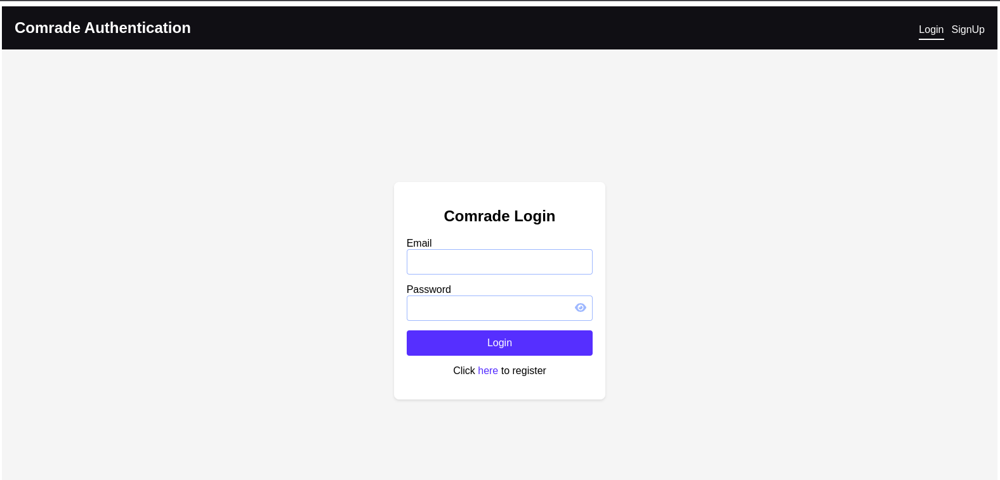
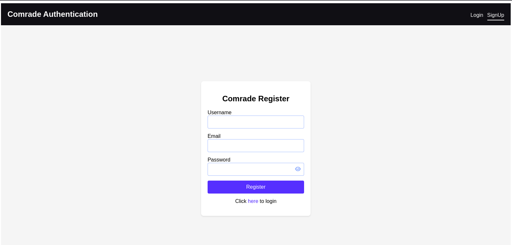
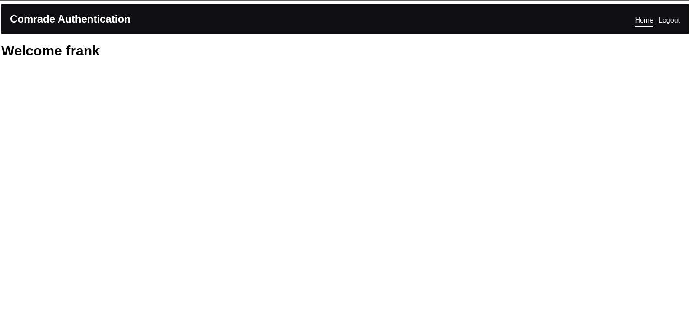

# Vue 3 Express JWT Authentication

## Description

A full-stack authentication system built with Vue 3, Express.js, JSON Web Tokens (JWT), and MySQL. This project provides user registration (sign-up) and authentication (sign-in) features, ensuring secure access to your application.

## Table of Contents

- [Prerequisites](#prerequisites)
- [Getting Started](#getting-started)
- [Usage](#usage)
- [Contributing](#contributing)
- [Images](#images)

## Prerequisites

Before you begin, ensure you have met the following requirements:

- **MySQL**: You need to have MySQL installed on your local machine. If you haven't installed it yet, you can download and install MySQL from the [official website](https://dev.mysql.com/downloads/).

  Ensure that you have the MySQL server up and running, and you can access it using a MySQL client.

- **Node.js**: This project requires Node.js. If you don't have Node.js installed, you can download it from the [official website](https://nodejs.org/).

- **npm (Node Package Manager)**: npm comes bundled with Node.js. You can verify your npm installation by running `npm -v` in your terminal.

## Getting Started

To run this project locally, follow these steps:

1. Clone the repository to your local machine:

   ```sh
   git clone https://github.com/Hackersgoddest/vue3-express-jwt-auth.git
   ```

2. Navigate to the project directory:
    ```sh
    cd vue3-express-jwt-auth
    ```

3. Install the required dependencies for the client and server:
    ```sh
    cd client
    npm install
    cd ../server
    npm install
    ```

4. Configure the environment variables:

    - Create a `.env` file in the `server` directory and set your JWT secret key and database connection details:
         ```sh
        DB_NAME=database_name
        DB_USER=database_user
        DB_PASSWORD=database_password
        DB_HOST=127.0.0.1
        DB_PORT=3306
        PORT=3000
        JWT_SECRET_KEY=your_jwt_key
        ```

5. Start the client and server:

    - Start the Vue 3 client:
        ```sh
        cd client
        npm run dev
        ```
    
    - Start the Express.js server(make sure mysql server is up and running):
        ```sh
        cd server
        npm run migrate
        npm run dev
        ```

6. Access the application in your web browser at http://localhost:8080.


## Usage

- This project provides user authentication functionality, including:

    - User registration (sign-up) with validation
    - User authentication (sign-in) with JWT token generation
    - Secure routes that require authentication
    - Error handling for authentication failures
- You can use this project as a starting point for building authentication features in your Vue 3 and Express.js applications.

## Contributing
- Contributions to this project are welcome! If you have ideas for improvements or bug fixes, please submit an issue or a pull request.

## Images



